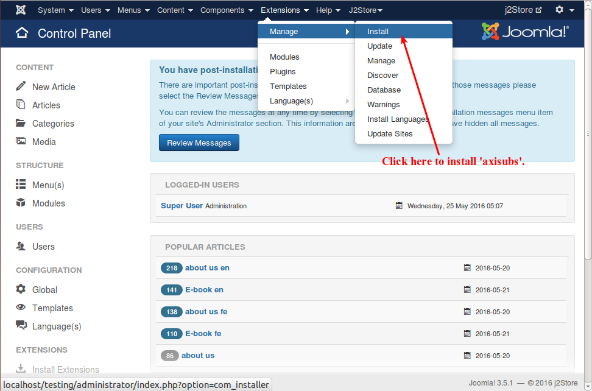
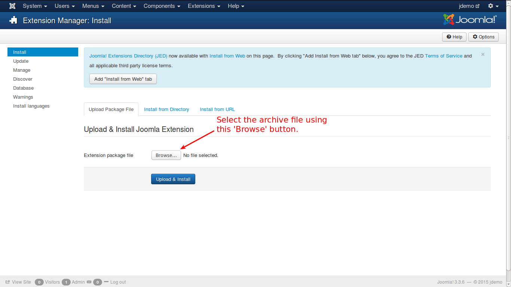

# Welcome to Axisubs

Axisubs is the flexible and modern subscription billing management system. It is very similar to normal subscription component but there are a few key differences which you need to keep in mind. Following steps will explain you briefly on how to get started with our Axisubs.

####Step 1 Installation

In your Joomla control panel top menu, go to Extensions -> Manage -> install , as illustrated below.

When you click here, you will be directed to the screen where you can select the downloaded/purchased packaged. See the image below:

As illustrated, select the package file and click 'Upload and Install'.

Axisubs is now installed and you will get this success message, as illustrated below.

####Step 2 Setup Currencies

Go to Axisubs > Setup > Currencies
Click the New button to start the currency creation process.
Enter all the required fields such as currency title, currency code, currency symbol, symbol position, Decimal places, Decimal separator, Thousands separator, Value, Status as like in the image below.

####Step 3 Configuration

Go to Axisubs > Setup > Configuration where the configuration page has 2 tabs. Each one is explained below in detail. They are:
* **Configurations**

  Please fill all the fields with your valid Address, zip code, country and zone.
  
  
  
* **Currency and Tax**

  Here you have to choose your default (primary) currency and setup the Tax configuration if you need.
  
  
####Step 4 Create Plan

Go to Axisubs > Plans
Click NEW button to create new plan where you can see two tabs Plan settings and Joomla User group which are explained below.

1. **Plan Settings**

 There are 3 segments in the plans.They are,
   
 * **Basic** - Please fill the fields plan name, alias, description, status.
 * **Period**- Enter your subscription period and price 
 * **Trial** - Enter the trial period and trial start condition.

####Display Plan in frontend

Once you created the plan, you can display it via menu. Go to menu manager and create menu with either Axisubs > Plan or Axisubs > Plans.

After choosing the menu item type, click the 'save' button. Once saved, go to Options tab and select the plan you have created and click save and close button.

A menu item will be created in the front end with the corresponding plan or plans in it.

