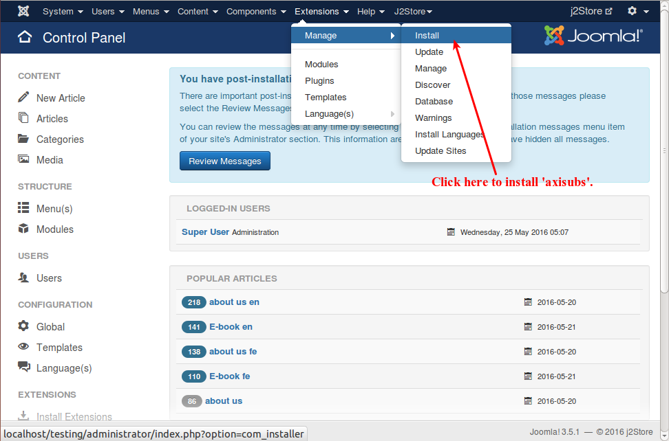
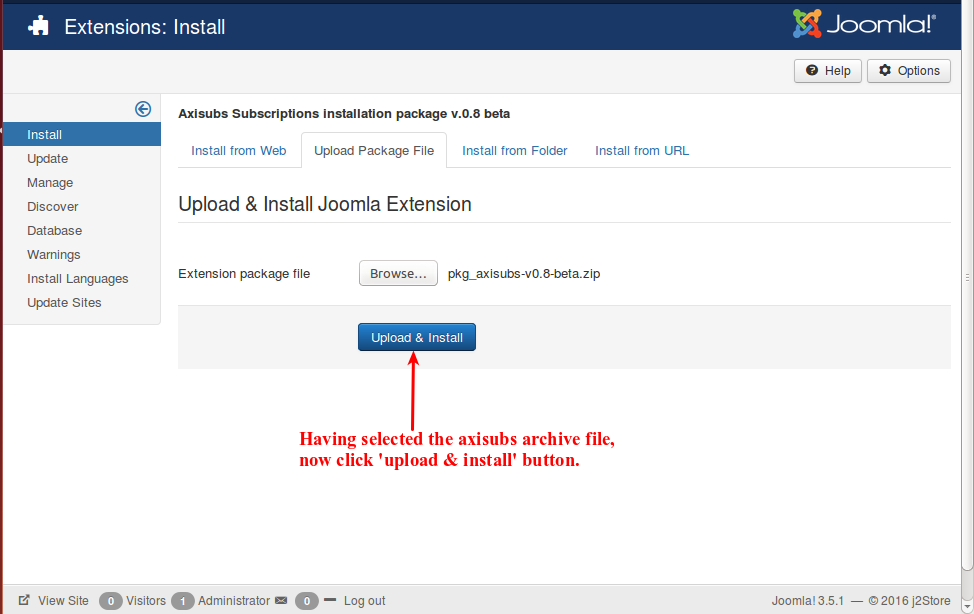
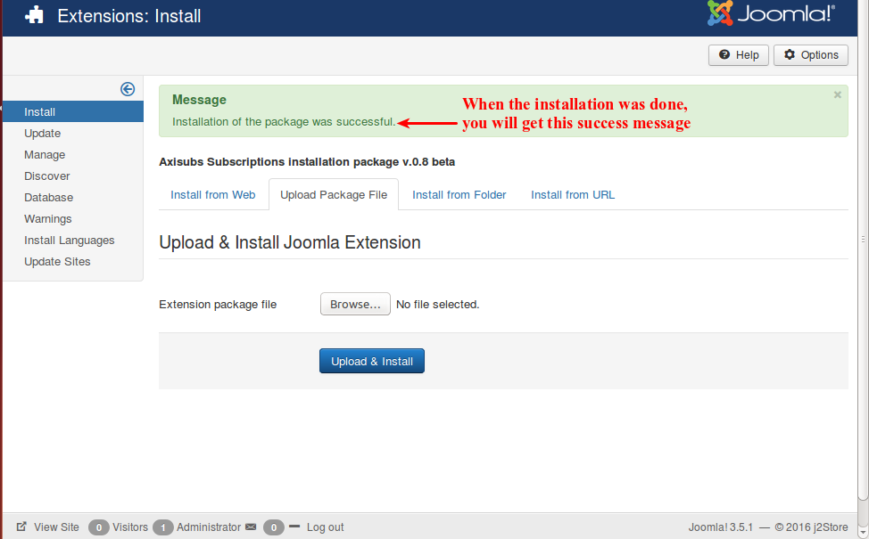
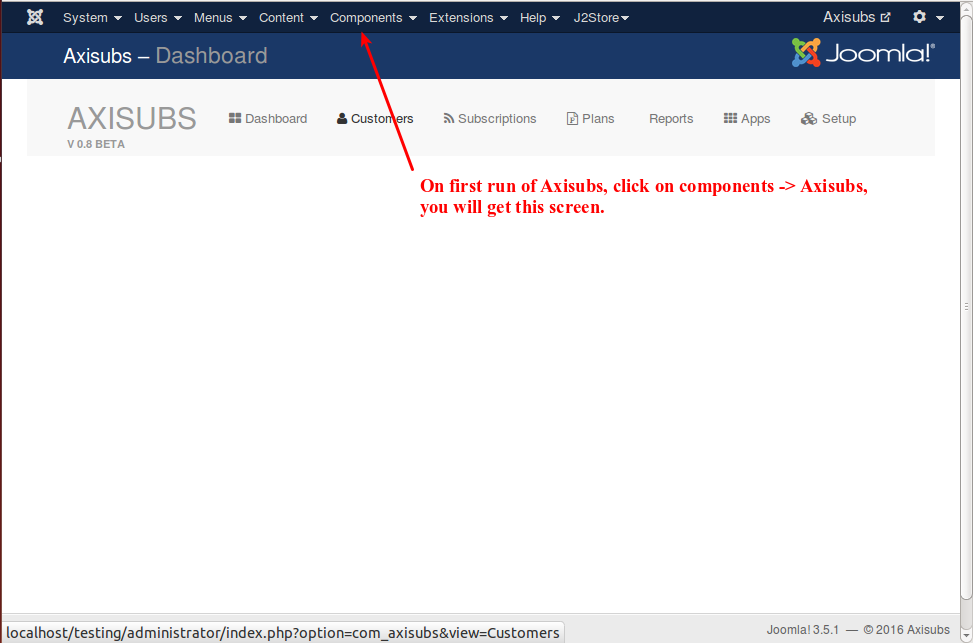

# Installation

To install Axisubs, you need Axisubs archive downloaded.

### Installation
In your Joomla control panel top menu, go to Extensions -> Manage -> install , as illustrated below.

When you click here, you will be directed to the screen where you can select the downloaded/purchased packaged. See the image below:

As illustrated, select the package file and click 'Upload and Install'.

Axisubs is now installed and you will get this success message, as illustrated below.

Now go to the topmenu->components->Axisubs, you will get the configuration screen as shown below:

Now, you are powered with Axisubs. Build your membership and subscription  management system.

