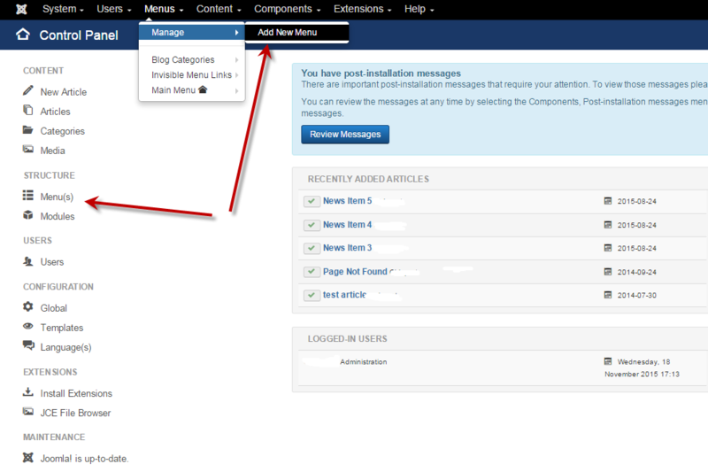
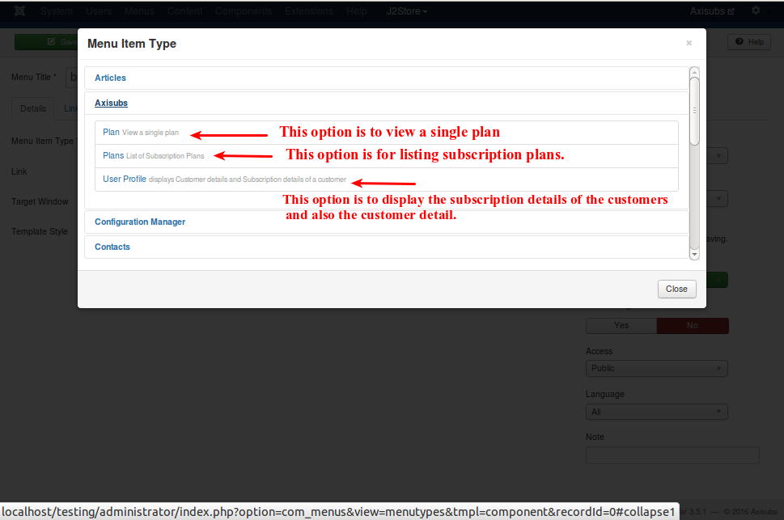

# Menu

A Menu is a set of menu items used for website navigation. Each menu item defines an URL to a page on your site, and holds settings that control the contents and style of that page.

<a name="create-MENU"><a>
## Creating a new Menu

There are 2 ways to add a Menu.They are,
   * Within the site administration panel, select Menus from the menu bar in the upper left corner. From the drop-down list, choose the "Manage" then choose "Add New Menu".
   
   * You can also select Menu(s) from the left column and then select "New" from the top left corner icons.
   
Refer the following image for better understanding,

In the toolbar, at the upper-left corner, select New. This will open the Menu Item page.

* Menu Title

    This will be the text displayed for the newly added menu item.eg., basic.
    Note: "Menu Title" is a required field.
    
* Alias

    Usually, you will leave this empty and Joomla! will fill this in for you automatically. The content of this field will determine the page URL when SEF is activated.

* Menu item type

  In the menu item type, choose the 'Axisubs' option from the list and the following options will be displayed,
  
    * plan
    
    This option is to view the single plan.
    
    * Plans

      This option is to display the list of subscription plans.
      
    * User profile

      This option is to display the subscription details of the customer and also the details of the customer.
      
The image below will explain it in a better way,

After choosing the menu item type, click the 'save and close' button.
A menu item will be created in the front end with the corresponding plan or plans in it.
