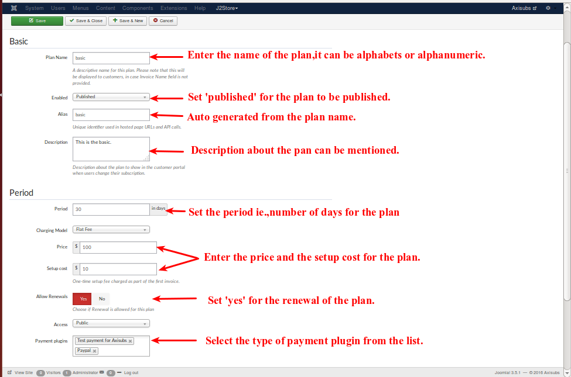
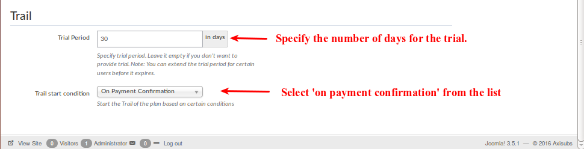

# Plans

There are 3 segments in the plans.They are,
* Basic
* Period 
* Trail

<a name="create-plan"><a>
##Creating a new plan

Click the New button to start the plan creation process.

<a name="create-plan-basic"><a>
##Basic

* Plan Name

  This is used when the plan name is to be displayed. E.g., Basic.
  
* Enabled

  If the option is selected as published, the plan created will be displayed. If the unpublished option is selected, then the plan is not displayed.

* Alias
 
  Enter an alias name. If you do not enter anything, Axisubs! will generate it for you.

* Description
  
  This is used to describe about the plan to show in the customer portal when users change their subscription.

<a name="create-plan-period"><a>
##Period

* Period

  Enter the number of days, you want this plan to be in existance.Once the period time is over,it will be expired.

* Charging model

  In this charging model , 2 optios are listed.They are,
   * Flat Fee
   * Per Unit
   
  choose any one of the charging model of your convience.
  
* Price

  In this price section, enter the price for the plan created. 

* Setup Cost
   
  In this section , enter the setup cost amount for the plan.

* Allow Renewals
 
  If **yes** option is selected , the plan will be renewaled after the expiry. If the plan should not renewal after the expiry, then **no** option is enabled.

* Payment Plugins

  In this payment plugins, 2 options are listed.They are,
  * Paypal
  * Test payment for Axisubs
  
  Either anyone of the payment plugins can be choosed or       both the payment plugins can be choosen.

<a name="create-plan-Trail"><a>
##Trial

* Trial Period

  Specify the number of days for the trial. If the session is empty, it means that you don't want trial.
 Note: You can also extend the trial period for certain users before it expires.

* Trial start condition

  Select the option,'on payment confirmation' from the list, which means that the trial period will start after the confirmation of the payment.

Check the images below to understand, how to create a plan.

Once the above details have been entered and the save option is clicked, the following will be created so that you can edit,delete the plans as shown in the image below,

