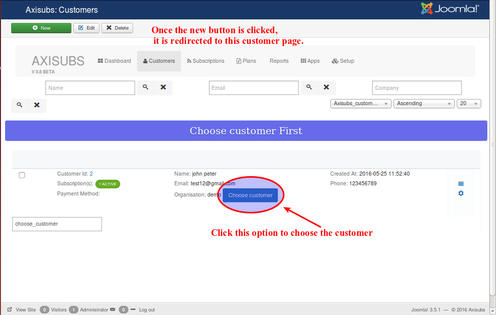
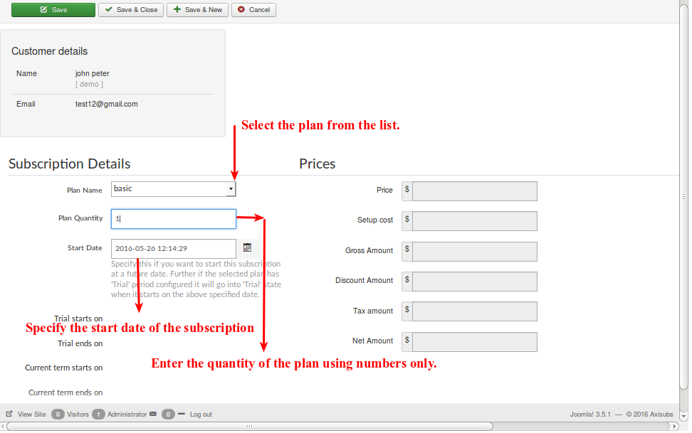
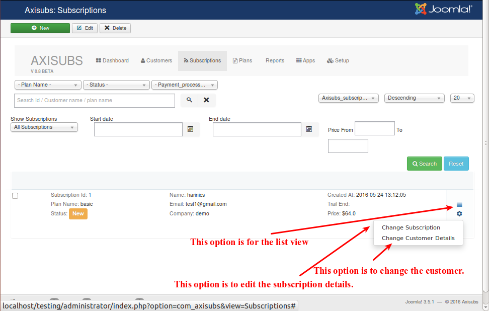
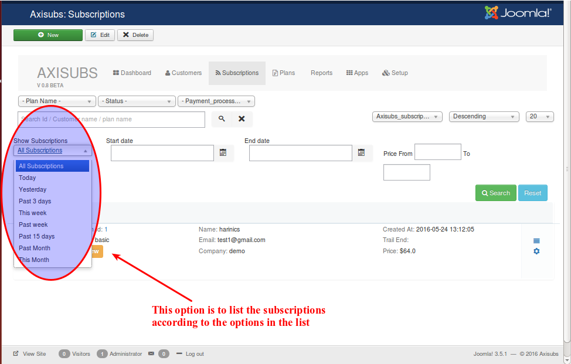

# Subscriptions

<a name="create-subscription"><a>
##Creating a new Subscriptions

Click the New button to start the Subscription creation process.

Once the new button has been clicked, it will be redirected to the customer page as you need to select the customer name to whom the Subscriptions has to be created.

Refer the below image for the better understanding.

After choosing the customer , the following details has to be filled.

   * Plan name
   
     Select the plan name from the list.
     
   * Plan Quantity
   
     Enter the quantity of the plan using only numbers.
     
   * Start date
   
     This section Specifies the date from when should the subscription has to be started. Further if the selected plan has 'Trial' period configured it will go into 'Trial' state, when subscription starts on the specified date. 
     
Refer the following image to check how to fill the plan name, quantity and start date.

Clicking the 'save and close' button, the following image displays the created subscription.

* Show subscriptions

  This option is to display the subscriptions according to the option selected from the list.eg., if today is selected, then the subscriptions created today will appear.

