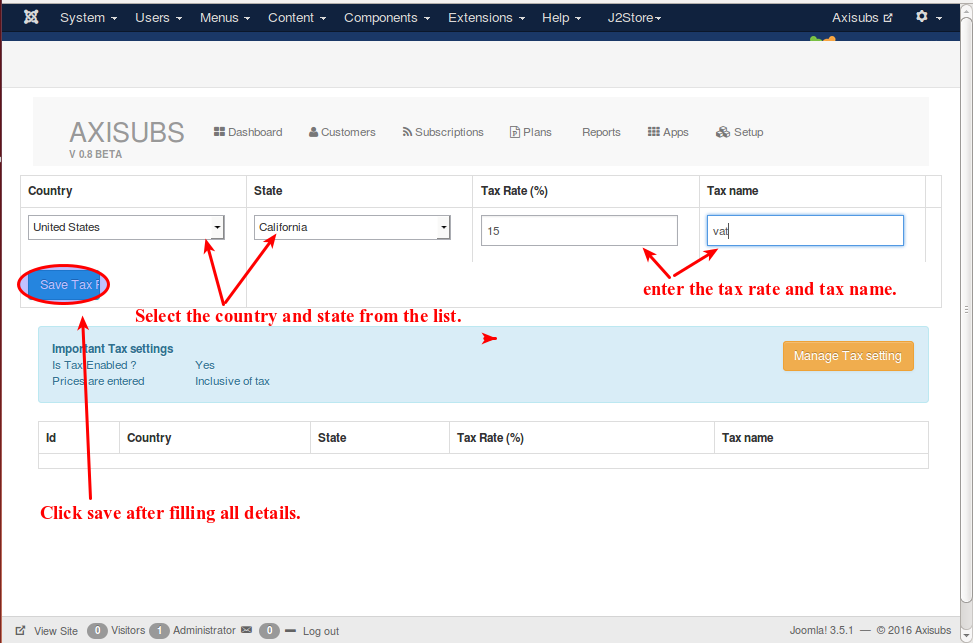
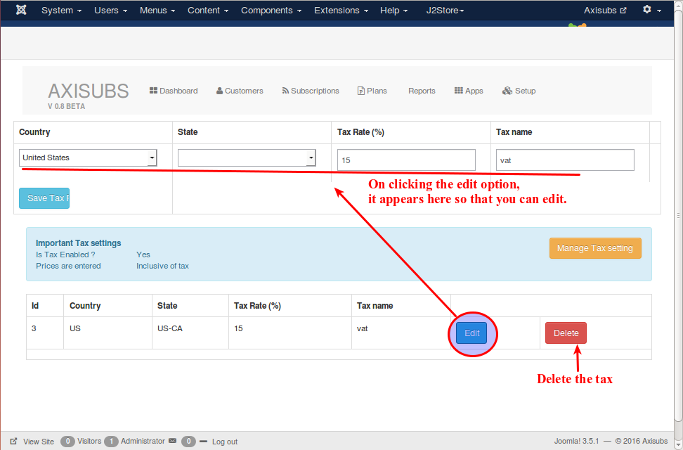

# Taxes

This section will help you to configure the tax.

* Country

  Select the country name from the list.
  
* State

  Select the state of the selected country from the list.
  
* Tax Rates
 
  Enter the tax rate using numbers only. No special characters or alphabets should be used.
  
* Tax Name

  Enter the name of the tax.
  
click 'Save tax' after filling all the details. 

Refer the following image for better understanding.

Once the tax has been created , you can edit or delete the tax as shown in the following image.

