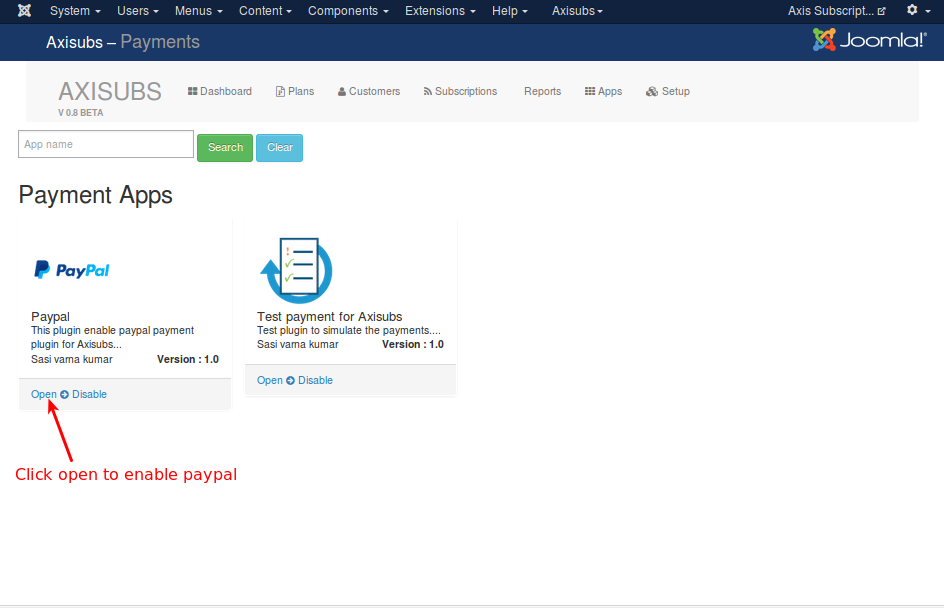
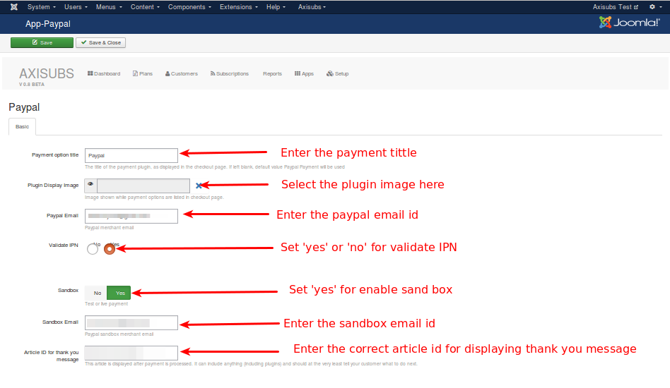
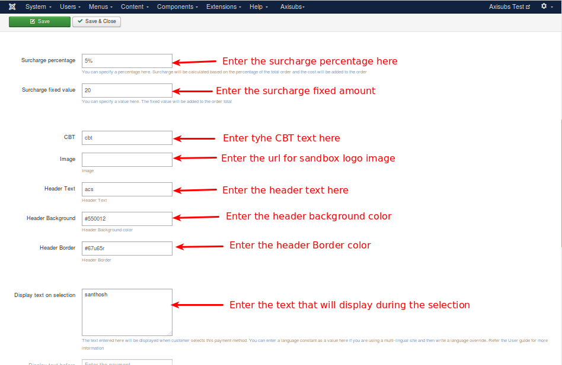
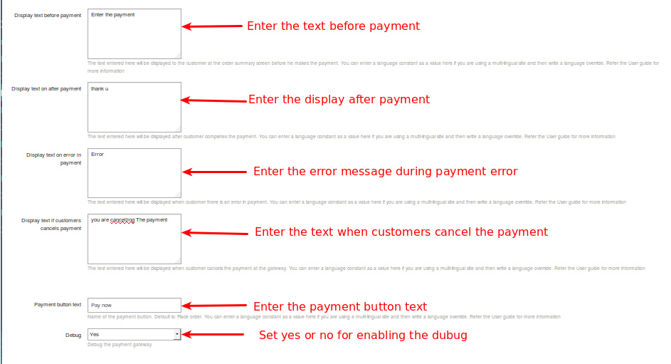
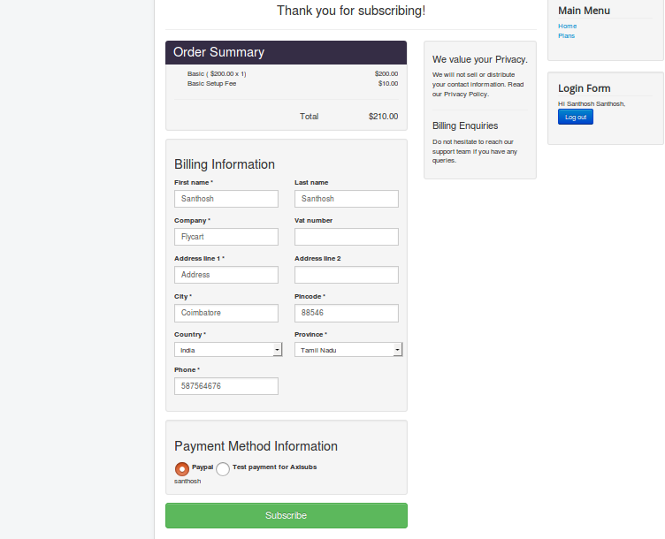
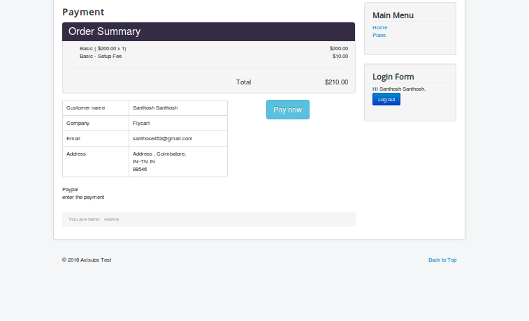
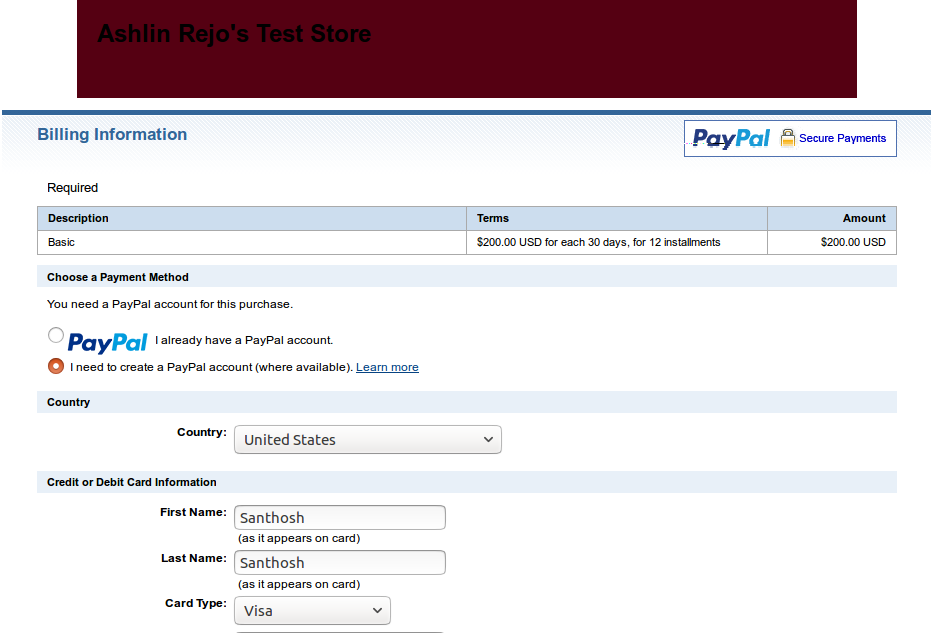

# Introduction

Paypal standard plugin for Axisubs. It allows you to accept payments via Paypal Payment Gateway. This uses the Paypal's Website Standard Payment. Customer will be redirected to Paypal to make payment securely.

#### Requirements

   + PHP 5.2 or higher

   + Joomla 2.5.x and above

   + Axisubs Beta

#### Configure Axisubs Paypal

Select the Setup Tab -> choose payment -> Select paypal

#### Parameter
 Paypal having the following parameters

+  Payment option title

 Set the name for the paypal option.The name what you have to  enter in the payment option tittle textbox  it will appear in the payment order history area.

+ Plugin Display Image

 This option will help you to set or assign the image for the paypal option. Image added here will be appeared in the payment gateways order history area.

+  Paypal Email

 Enter the valid Paypal registered emai id of the merchant.

##### What is IPN ?

Instant Payment Notification (IPN) is a message service that automatically notifies merchants of events related to PayPal transactions. Merchants can use it to automate back-office and administrative functions, including automatically fulfilling orders and providing customers with order status.

+ Validate IPN

 It has 2 boolean option 'yes' or 'no'. if You will set 'yes' means validate IPN will be gets activated. Set no means it doesnot get activated.

##### Sand Box

The PayPal Sandbox is a self-contained, virtual testing environment that mimics the live PayPal production environment. It provides a shielded space where you can initiate and watch your application process the requests you make to the PayPal APIs without touching any live PayPal accounts.

+ sandbox 

 Sand box has 2 boolean option yes and no. Set **yes** is to enable the sand box and set **no** to disable the sand box.

+ Sandbox Email
 Enter the valid sandbox email id of the merchant.

+  Article ID for thank you message

 Enter the article id (which contains thank you message contents) to display the thank you message when customers return from the paypal.

+ Surcharge percentage

 You can collect a percent of the total order value as surcharge / fee for using the Paypal option from your customers using this option. You can enter a value here (for example: 2 ). If you enter 2 here, then 2 % of the total order value will be added as a handling cost to the order.

This is optional parameter.

    NOTE: DO NOT enter any symbol like % here.

+ Surcharge fixed value

 You can collect a fixed surcharge / fee for using the Paypal option from your customers in addition to the order value. You can enter a value here (for example: 2 ). If you enter 2 here, then 2 will be added as a handling cost to the order.

If you Leave it empty means, you dont want to charge.

This is an optional parameter.

+ Image

 The URL of the 150x50-pixel image displayed as your logo in the upper left corner of PayPal’s pages. Default: your business name (if you have a Business account) or your email address (if you have Premier account). If this is not working, try using the Custom Header Image param above.

 This is an optional setting.

+  Header Text

 Enter the header tittle of your PayPal checkout page's header here.

+ Header Background
 Use this option to set the background color for header. The hex-code of your PayPal checkout page's header backgroud, e.g. FFFFFF.

This is an optional setting.

+ Header Border

 The 6 digit hex-code to the color for payPal checkout page's header border, e.g. FFFFFF for white.
 This is an optional setting.

+ Display text on selection

 The text what you have entered here will be appeared on payment selection.

+ Display text before payment

 The text entered here will be displayed to the customer at the order summary screen before he makes the payment. 

+  Display text on after payment
 The text entered here will be displayed to the customer after he makes the payment.

+  Display text on error in payment
 The text what you have entered here will be displayed to the customer when there is an error in the payment process.

+  Display text if customers cancels payment

 The following text  you will entered here will it displayed to the customer when he/she cancels the payment at the gateway (NOT in your site).

+  Payment button text

 Text entered here will be added as the name of the payment button.

+ Debug

 Choose YES to enable the debug mode. If you set this to yes, then debug messages will be logged and saved in the cache folder in your Joomla root directory. DO NOT select YES in the live site.

Fill the above mentioned parameters as like the below images

Now, the paypal is working like a below images

