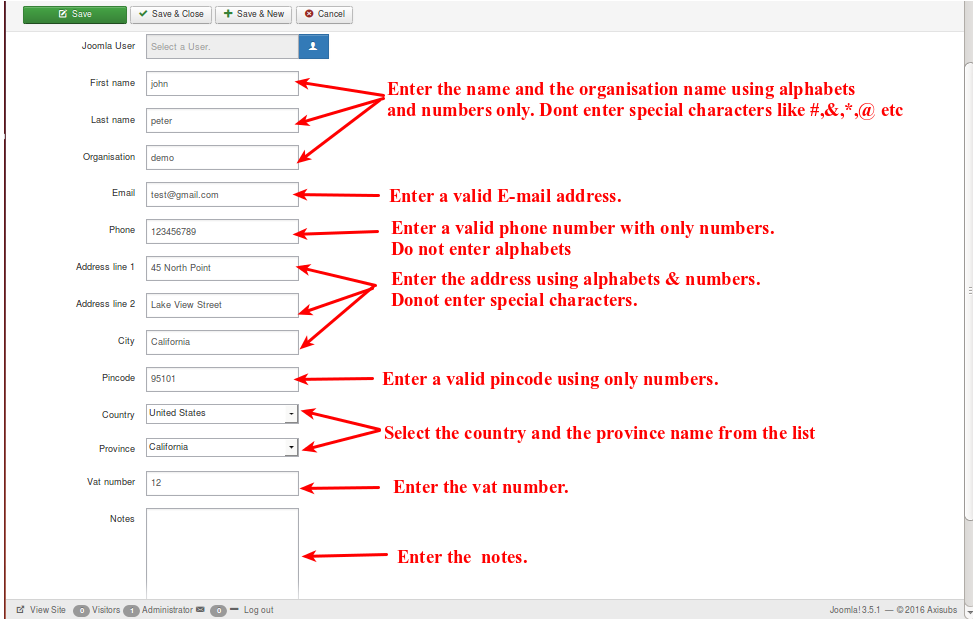
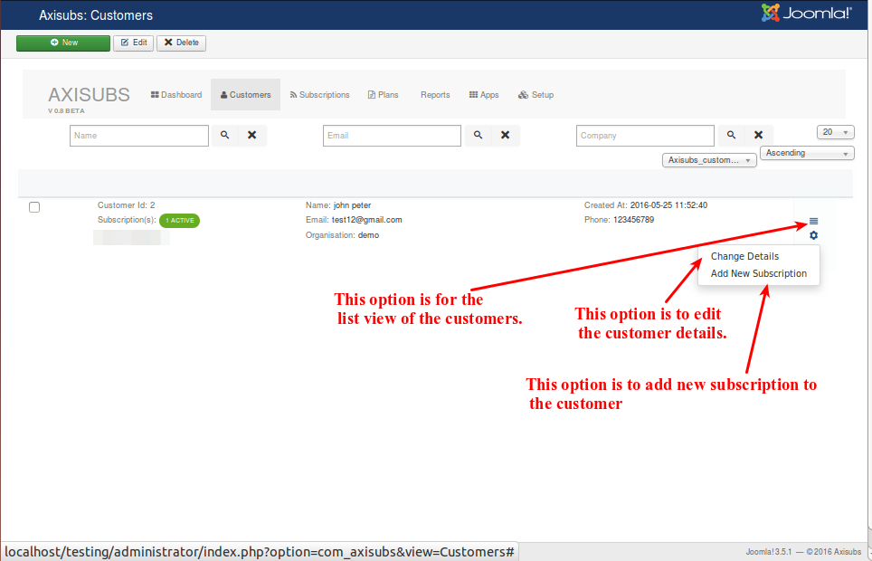

# Customers

Customers are those who buys plans.

<a name="create-customers"><a>
##Creating a new customer

Click the New button to start the customer creation process.

* ***First name and Last name***

  Name of the customer. One must enter a name with only alphabets. No special characters should be used.
  
* ***Organisation***

    Name of the organisation. One must enter a valid organisation name.
    
* ***Email***

     Enter a valid Email address.
     
* ***Phone***

     Enter a valid phone number using numbers only. No alphabets should be used.

* ***Address, City***

    The address and city of the store is mandatory. You can enter an address using alphabets or numbers but no special characters should be used.
    
* ***Pincode***

    Enter a valid pincode of the organisation. This field can not be empty.

    
* ***Country Name***

    Name of the country in which the organisation exists. To be selected from the given list.

* ***Province***

    Name of the zone in the country. To be selected from the given list.
    
* ***Vat number***

     Enter a vat number using numbers. No special characters or alphabets should be used.

* ***Notes***

     Enter any notes about the customer. This field can not be empty.

Check the image below to understand how to enter name email, organisation name , phone and address etc.

Once the above details have been entered and the save option is clicked, the following will be created so that you can edit,add new subscription to the customer as shown in the image below,

