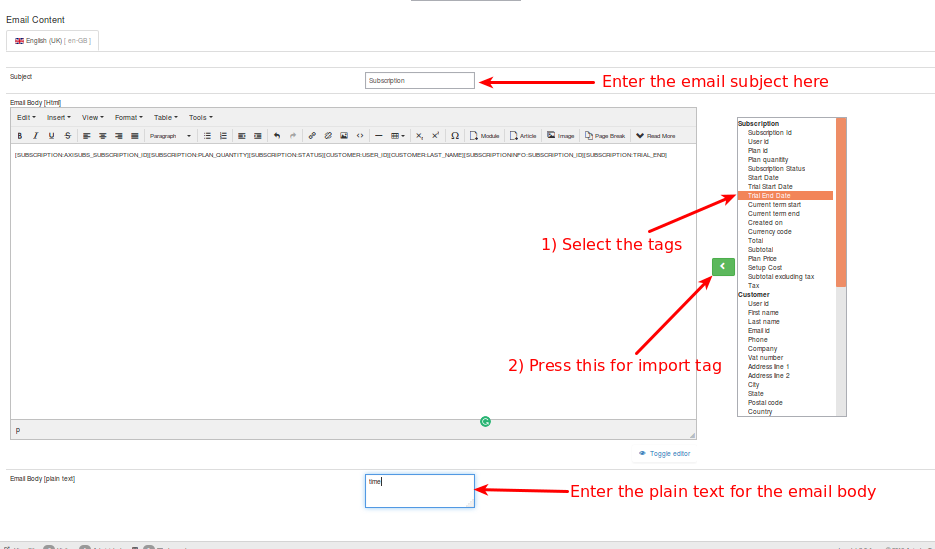

# Email Templates

Axis Subs email templates allow you to customize the formatting and text of emails sent by users who share your content.

#### Customizing Email Templates

Select email templates through the following link Axis subs -> Setup -> Email Templates.

The email templates will have the following parameters.

##### Events

Axisubs offers the feature of sending email based on the event. Based on the event selection from the dropdown list the email and its contents send to the user/ customer.

#### Enabled

It has to be enabled first to send email based on the events.

##### Recipients

The Mail has to be send to the group of peoples base on the selection. Available User groups are listed at the right side end of the page. To add an entry in the recipients box select the options availble in the box and make double click on the option.

#### CC

It stands for "carbon copy." Anyone you add to the cc: field of a message receives a copy of that message when you send it. All other recipients of that message can see that person you designated as a cc recipient. To add an entry in the cc click the box and type the valid email addresses.

##### BCC

It stands for "blind carbon copy." Anyone you add to the bcc: field of a message receives a copy of that message when you send it. But, bcc: recipients are invisible to all the other recipients of the message including other bcc: recipients. To add an entry in the bcc  field, Click and enter the valid email addresses.

##### Subject
Give the subject for the email.

##### Email Body

There are number of shortcodes available at the right side of the page. These shortcode tags are used to display the dynamic content like subscription information and subscriber information. Simply select the shortcode tags and press left arrow < now, the tags will be added to the Email body.

Use the toggle editor to place the html tags and to style your email template.

