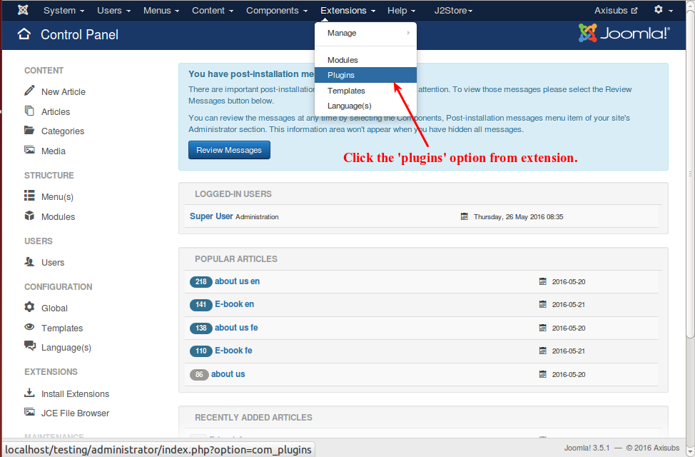
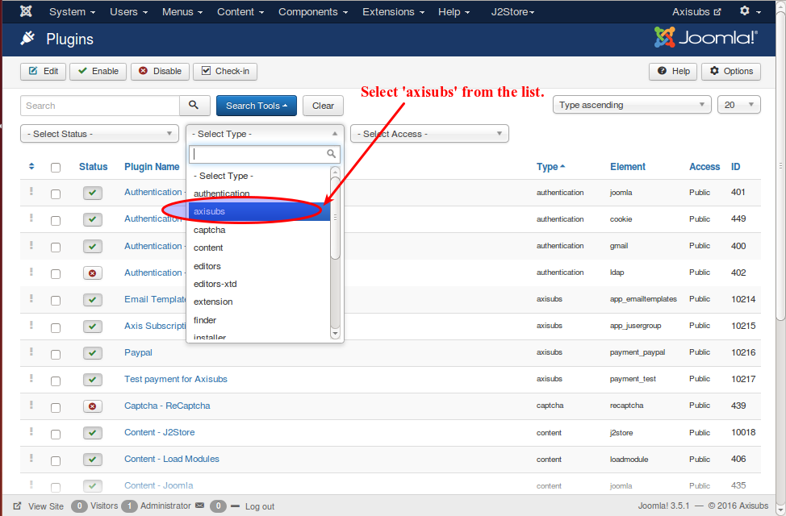
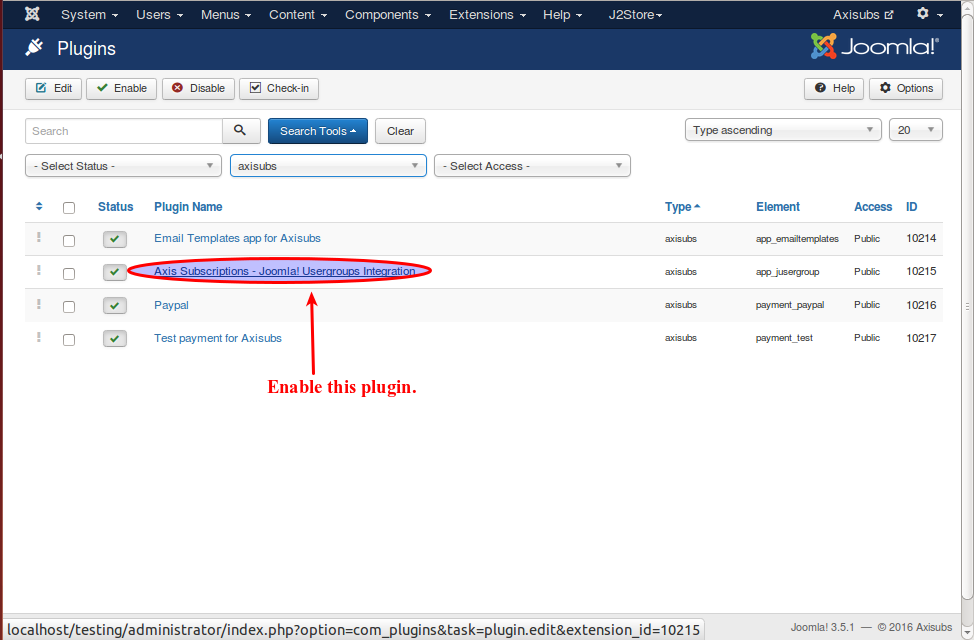
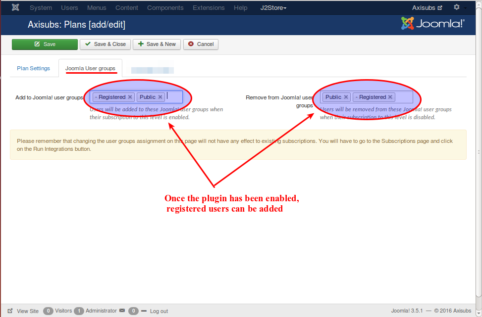

# Integrations 

In your Joomla control panel top menu, go to Extensions -> plugin , as illustrated below.

In the search tools, select the type as **Axisubs** , as illustrated below.

Now , enable the 'Axis Subscriptions - Joomla! Usergroups Integration' plugin as shown in the following image,

Now , go to topmenu->components->Axisubs->Plans , in the 'joomla user groups' section you can now add registered users to the user group as illustrated below.

